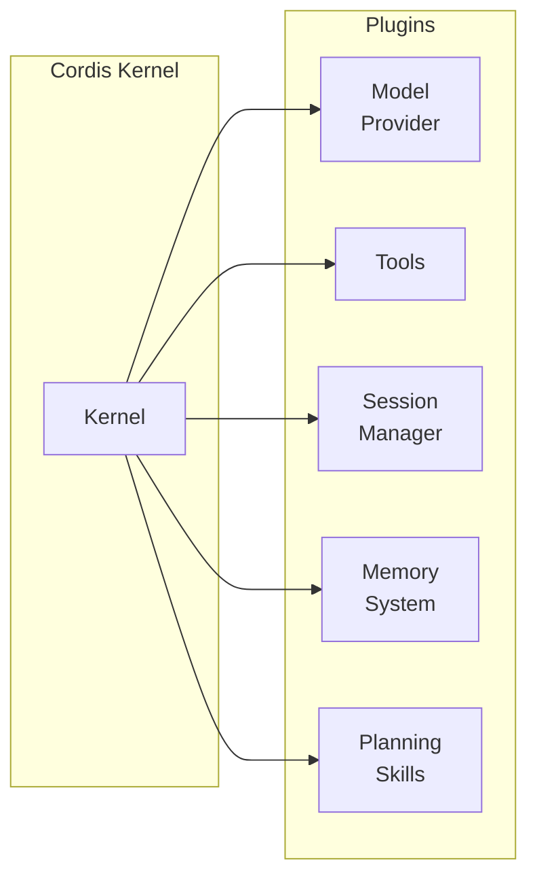
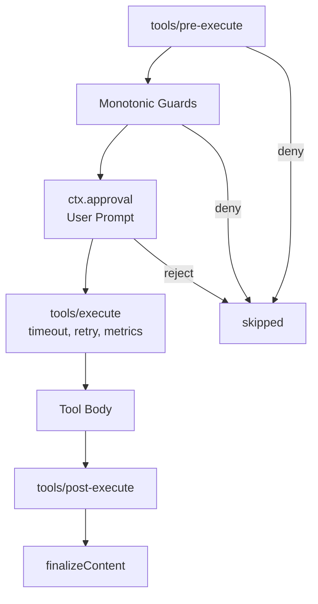

# 為什麼我看好 DeepSeek Harness：從痛點到實際應用

## 先問一個問題：你用過的 Agent 框架，最大的困擾是什麼？

是 LLMWare 太封閉、RAG 流水線太脆弱、還是 LangChain 更新一次就壞一片 Plugin？

DeepSeek 近期低調開源的 **[DeepSeek Harness](https://github.com/deepseek-ai/deepseek-harness)**（簡稱 `dsh`）——163k Stars、12,400+ commits——試圖回答一個更根本的問題：

> **如何讓 AI Agent 在真實世界穩定運作，而不是只會在 Demo 裡優雅運轉？**

---

## 一、現在的 Agent 開發有什麼問題？

### 問題 1：能力與框架深度耦合

大多數 Agent 框架把「模型調用」「工具執行」「對話管理」「記憶體」全部寫死在一個 SDK 裡。想換一個 LLM Provider？重寫。想加一個 Memory 系統？改核心代碼。想在正式環境加入審批機制？得 hack。

結果：**實驗環境很美好，生產環境很悲慘**。

### 問題 2：執行過程是黑箱

當 Agent 執行了一連串 Tool Call，你知道它看到什麼、用過哪些資訊嗎？大多數框架的答案：「不知道，等它結束再看結果。」

問題在於：當 Agent 在正式環境裡做出錯誤決策時，你沒有辦法回溯。它可能是吃了錯誤的上下文、可能是 prompt 被汙染、也可能 Tool 結果被錯誤解析。無法審計，就無法改善。

### 問題 3：測試和調試困難

Agent 的輸出是非確定性的，如何測試？大多數框架沒有好的機制。要嘛降低到只測 prompt，要嘛就得跑 end-to-end 然後祈禱。代價高、反饋慢。

---

## 二、DeepSeek Harness 的核心思路：「一切皆插件」

Harness 的底層由 [Cordis](https://github.com/cordiverse/cordis) 框架驅動，核心哲學只有一句話：

> **Every capability is a plugin.**

這不是行銷口號，而是架構事實。在 DSH 裡：

- 模型調用 → 插件
- 工具執行（bash、file、web search） → 插件
- 對話管理（session、turn、step） → 插件
- 記憶體系統 → 插件
- 排程提醒 → 插件
- 沙箱隔離 → 插件
- 整個 UI → 插件



好處是什麼？

| 痛點 | DSH 解法 |
|------|---------|
| 想換模型 Provider | 替換一個插件 |
| 想加 Memory | 插入一個插件 |
| 想加審批環節 | 插入一個插件 |
| 想在正式環境隔離執行 | 換一個沙箱插件 |
| 想實驗新能力 | 新增一個插件，不動核心 |

**不需要 fork 框架，不需要等官方支援，自己動手豐衣足食。**

---

## 三、Cordis 的五個核心概念

Cordis 是 DSH 的核心引擎，理解它的概念等於理解整個框架的設計邏輯：

### 1. Plugin = Service
插件就是一個帶生命周期的 Service對象，實現 `ctx.<key>` 接口。可以是簡單函數，也可以是完整的類。

### 2. Context = 服務容器
每個 Service 佔據一個穩定的 `ctx.<key>` 位置，其他插件透過 key 查找服務，**而非直接 import 實現**。這就是依賴反轉。

### 3. inject = 依賴聲明
插件宣告自己需要哪些服務，Cordis 自動等待這些服務就緒才啟動。**啟動順序由依賴關係決定**，不需要手動排程。

### 4. 類型化事件
服務之間透過 `emit`/`waterfall`/`parallel`/`serial` 四種模式通信。這不是簡單的事件總線，而是**帶語義的分發策略**：

```typescript
// emit: 觀察，無返回值
// waterfall: 包裝請求，可短路
// parallel: 並行觀察
// serial: 依序觀察，累積結果
```

### 5. 可逆註冊（ctx.effect）
所有注册都是副作用，teardown 時自動撤銷。記憶體不會洩漏。

---

## 四、解決了什麼問題？

### ✅ 問題 1 解決：深度可組合性

實際例子：MCP（Model Context Protocol）記憶體整合。

DSH 內建 MCP Client 插件，只要一行配置就能把第三方記憶體系統接進來：

```sh
# 透過 MCP 接 Engram 記憶體
npx @deepseek-ai/dsh web --patch "examples/mcp-memory/engram.cordis.yml"
```

三種記憶體系統（Memorix、MCP Reference Memory、Engram）任選，都是「插件替換」模式。**不需要改 DSH 代碼，不需要等官方適配，自己配上去就能用。**

### ✅ 問題 2 解決：完整軌跡審計

DSH 的 Session Log 是 append-only 的事件流，記錄：

- System prompt 每次組裝結果
- 每次 Reasoning 過程
- 每次 Tool Call 的輸入輸出
- Subagent 的調度與結果
- 每次 Context 注入的內容

在 Trajectory 視圖裡，你可以：
- **Resume**：從任意中斷點恢復
- **Fork**：複製對話分支
- **Search**：搜尋歷史對話
- **Replay**：重放整個執行過程

```
Session Event Log (append-only):
─────────────────────────────────────
turn/start
  step/start
    system-prompt/assembled → { full prompt content }
    agent/request → { model, temperature, ... }
    llm/stream → { chunks... }
    assistant/message → { final message }
    tool/call → { tool: "bash", args: "git status" }
    tool/result → { output: "..." }
  step/end
turn/end
```

**當 Agent 出錯時，你有一條完整的因果鏈可以追查。**

### ✅ 問題 3 解決：多種執行模式

DSH 內建四種模式，針對不同場景：

| 模式 | 用途 |
|------|------|
| **Standard** | 完整工具集：file edit、shell、web search、skills、planning、subagents、workflows |
| **Code** | 把工具包裝成 SDK，讓模型自己寫 TypeScript 程序來組合多步操作 |
| **Minimal** | 極簡環境：只有 bash + file edit，用於基准測試模型能力 |
| **Creator** | 插件實驗室：即時檢查 Runtime、測試插件組合、創作新模式 |

```
┌─────────────────────────────────────────────┐
│  Mode Picker                                │
├─────────────────────────────────────────────┤
│  ○ Standard ─ Full coding agent             │
│  ○ Code ─ Code Mode SDK orchestration       │
│  ○ Minimal ─ Two-tool benchmark agent       │
│  ○ Creator ─ Plugin lab & preset authoring  │
└─────────────────────────────────────────────┘
```

### ✅ 生產級能力：工具執行流水線

DSH 的工具執行經過嚴格分層控制：



每層都可以包裝、改寫結果。**鉤子（hooks）、審批（approval）、超時重試，全部是可插拔的插件，工具本身不需要知道這些邏輯。**

### ✅ 安全能力：沙箱隔離

Harness 支援把工具執行放到隔離沙箱中，例如 [E2B](https://e2b.dev/) 雲端沙箱。Local filesystem 和 subprocess 插件可以被一鍵替換為雲端沙箱：

```yaml
# e2b.cordis.yml — 替換本地工具為雲端沙箱
- insert:
    - id: e2b-sandbox
      name: '@deepseek-ai/dsh-e2b'
      config:
        sandboxTemplate: standard
```

**本地開發、雲端執行，隔離級別可選。**

---

## 五、實際應用場景

### 場景 1：本地 Coding Agent

```sh
# 最簡單的使用方式
npx @deepseek-ai/dsh web

# 指令列模式
pnpm dsh --profile headless "fix the failing test in this workspace"
```

設定 `DEEPSEEK_API_KEY`，就能讓 Agent 幫你分析代碼庫、修復 Bug、寫測試。完整的事件日誌讓你清楚看到它為什麼這麼改。

### 場景 2：多輪對話 + 記憶跨 Session

透過 MCP Memory 插件，Agent 可以「記得」之前對話中的偏好設定：

1. Session A：「幫我記住我的驗證飲料是 lapsang-black-tea」
2. Session B：「我剛才的驗證飲料是什麼？」→ Agent 從記憶體系統查詢，返回正確答案

**新的對話不需要重新設定前提，記憶持久化在外部系統。**

### 場景 3：排程提醒

```sh
# 啟用排程插件
dsh web --patch examples/web-schedule/cordis.yml
```

Agent 可以創建、列舉、刪除提醒，且提醒綁定到對話 Session。離開對話後再回來，過期的提醒會自動觸發後續對話。

### 場景 4：企業內部的 Agent 流水線

透過 API Gateway + Typert，Harness 提供完整的 Client-Server 類型安全 RPC：

```typescript
// Host 端：聲明 Remote 方法
export class GoalService extends TypertRemoteService {
  @Remote('create')
  createForClient(agent: Agent, request: CreateGoalRequest, signal: AbortSignal) {
    return this.create(agent, request)
  }
}
```

構建時自動生成 Client 端的類型安全接口，確保前後端 API 不會因為簽名變更而悄悄 break。

---

## 六、橫向比較：DSH vs 競爭者

| 維度 | LangChain | AutoGen | DSH |
|------|-----------|---------|-----|
| 插件系統 | 有，但深度耦合 | 有限 | 一切皆插件 |
| 執行審計 | 日誌分散 | 基本 | 完整事件流 |
| 工具流水線 | 自己實現 | 自己實現 | 框架內建分層控制 |
| MCP 整合 | 需第三方適配 | 無 | 官方支援 |
| 沙箱隔離 | 無 | 無 | 原生支援 |
| 架構穩定性 | API 經常變更 | 實驗性 | 嚴格的 TypeScript 雙 Aggregate 設計 |

DSH 的最大差異：**它不只是讓 Agent 跑起來，而是讓 Agent 在複雜、多變的真實環境中「可維護、可審計、可擴展」。**

---

## 七、誰適合用 DSH？

**適合：**
- 需要在正式環境部署 Agent 的開發團隊
- 想實驗新工具/新模型，不想動框架的人
- 對執行過程有審計需求的合規場景
- 需要深度客製化 Agent 行為的企業

**不急於跟進：**
- 純研究目的，只需要快速跑 Demo
- 還在評估 Agent 架構，不知道自己需要什麼能力

目前 DSH 仍在 **developer preview**（v0.1.0-rc.7），API 可能有不兼容變更。但對於有長期視角的團隊，這是一個值得投入的方向。

---

## 相關連結

- [GitHub: deepseek-ai/deepseek-harness](https://github.com/deepseek-ai/deepseek-harness)（163k ⭐）
- [官方網站: deepseek.com/harness](https://deepseek.com/harness)
- [Cordis 框架論文](https://github.com/cordiverse/paper)
- [Discord 社區](https://discord.gg/Ycq5dCaS4)
- [插件生態目錄](https://github.com/topics/dsh-plugin)

---

*本文同步發表於 [higumalu-note](https://higumalu.github.io/higumalu-note/)。*