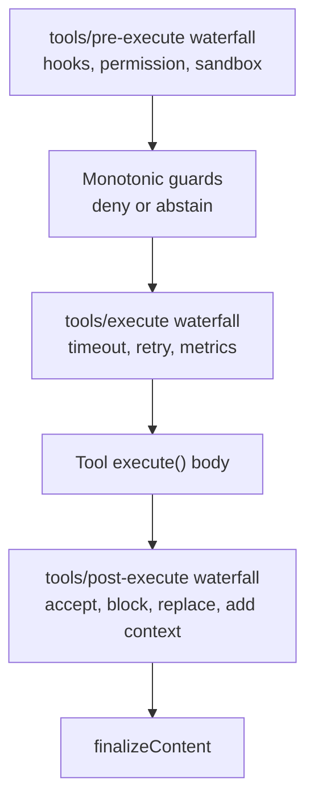
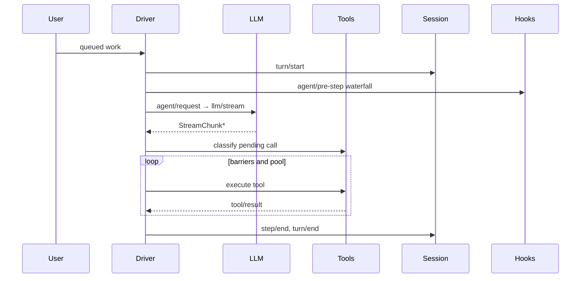

# DeepSeek Harness 深度解析：一切皆插件的 Agent 開發框架

## 前言

DeepSeek 近期在 AI 開源生態動作頻頻，除了大家熟知的 V3/R1 模型，還低調開源了一個相當有特色的專案——**DeepSeek Harness（簡稱 `dsh`）**。這是一個以插件化架構為核心的 Agent 開發框架，目前已有 **163k Stars**、**12,400+ commits**，成長速度驚人。

> [GitHub: deepseek-ai/deepseek-harness](https://github.com/deepseek-ai/deepseek-harness)

---

## 核心哲學：Everything is a Plugin

Harness 最大的特色就是「**一切皆插件**」（Everything is a Plugin）的設計理念。整個框架由 [Cordis](https://github.com/cordiverse/cordis) 驅動，這是一個專為時空可組合性設計的框架，詳細設計見論文 [*A Programming Paradigm for Spatiotemporal Composability*](https://github.com/cordiverse/paper)。

### Cordis 的五個核心概念

| 概念 | 說明 |
|------|------|
| **插件（Plugin）** | 實現 Service 的對象，可帶 `inject` 和 `apply(ctx)` 欄位 |
| **上下文（Context）** | 服務的容器，佔據穩定的 `ctx.<key>` 位置 |
| **依賴注入（inject）** | 插件聲明所需服務，自動等待就緒後啟動 |
| **類型化事件** | 透過 `emit`/`waterfall`/`parallel`/`serial` 分發 |
| **可逆註冊** | `ctx.effect()` 或 `ctx.on()` 安裝，teardown 時自動撤銷 |

這種設計讓每個功能模組（LLM、工具、會話管理）都是獨立的插件，開發者可以自由替換、組合，而不需動搖核心。

---

## 架構亮點

### 1. 嚴格的 TypeScript 雙 Aggregate 設計

Harness 的 TypeScript 專案分為 **Host** 和 **Client** 兩個隔離的 aggregate：

```
packages/
├── host/          # Node.js 端：業務邏輯、工具執行
└── client/        # 瀏覽器端：UI、Web UI
```

這是因為 Cordis 的 `Context` 介面在兩側以不同服務做聲明合併，若放進同一個 `ts.Program` 會發生衝突。分開後各自編譯，確保類型安全。

### 2. API Gateway + Typert 嚴格類型 RPC

Harness 提供了一套完整的 Client-Server 類型安全通信方案：

```typescript
// Host 端：業務服務聲明 Remote 方法
export class GoalService extends TypertRemoteService {
  @Remote('create')
  createForClient(agent: Agent, request: CreateGoalRequest, signal: AbortSignal) {
    return this.create(agent, request)
  }
}
```

透過 Typert generator 在構建時分析 Remote 簽名，自動生成：
- **Host 反射產物**：運行時類型描述符
- **Client 投影**：嚴格類型的 Client 调用接口

### 3. 工具執行流水線

工具從調用到完成經過嚴格的分層控制：



每層都可以改寫結果，支援鉤子（hooks）、審批（approval）、超時重試等策略，且無需讓工具本身耦合這些邏輯。

### 4. Agent 生命周期管理



完整的對話、輪次（turn）、步驟（step）追蹤，所有事件都持久化到 `session/event` 中，可隨時回放。

---

## 快速上手

### 從 npm 運行（最簡方式）

```bash
# 安裝 Node.js 後直接運行
npx @deepseek-ai/dsh web
```

啟動後訪問 `http://127.0.0.1:3080` 即可進入 Web UI。

### 從源碼運行

```bash
git clone https://github.com/deepseek-ai/deepseek-harness.git
cd deepseek-harness
pnpm install
pnpm run build
pnpm dsh web
```

### Headless 模式

設定 `DEEPSEEK_API_KEY` 後，可運行純命令行 Agent：

```bash
pnpm dsh --profile headless "summarize this workspace"
```

---

## 生態與擴展

### 插件系統

官方支持 `@dsh-plugin` topic，任何人都可以發布自己的插件：

```typescript
// 插件結構示例
export default function myPlugin(ctx: Context) {
  ctx.effect(() => {
    // 註冊工具、提示詞、事件監聽
    return () => {
      // teardown 時清理
    }
  })
}
```

### 開發者工具鏈

- **本地檢查**：Lefthook 鉤子自動校驗代碼風格、翻譯配對
- **CI 門禁**：類型檢查、構建、測試分為獨立 lane
- **文檔生成**：`doc-sync` 自動同步英文↔中文文檔

---

## 結語

DeepSeek Harness 代表了新一代 Agent 框架的設計方向：

1. **插件化優先** — 功能替換不動核心，實驗新能力只需加插件
2. **類型安全** — 從 RPC 到工具 schema，全鏈路 TypeScript 保障
3. **可審計性** — 所有對話歷史、工具調用完整持久化
4. **生產就緒** — 嚴格的構建流水線、測試覆蓋、貢獻者指南

目前仍在 **developer preview** 階段（v0.1.0-rc.7），API 可能有不兼容變更，但對於想深入理解 Agent 系統架構、或準備在生產環境構建可靠 AI 應用的開發者，這是一個值得關注的專案。

> **相關連結**
> - [GitHub Repo](https://github.com/deepseek-ai/deepseek-harness)
> - [Discord 社區](https://discord.gg/Ycq5dCaS4)
> - [Cordis 框架論文](https://github.com/cordiverse/paper)

---

*本篇為技術介紹文，更多實戰開發心得待續。*